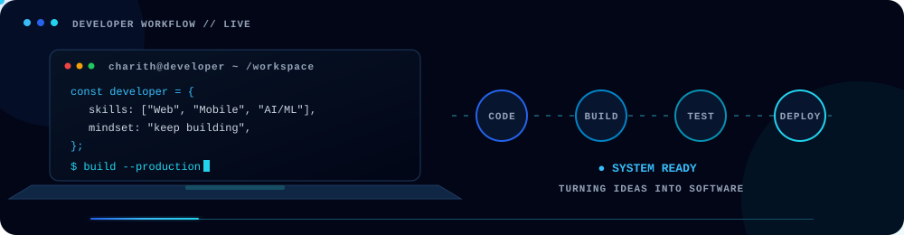

<p align="center">
  
</p>

<p align="center">
  
</p>

---

## 👨‍💻 About Me

```typescript
const charith = {
  education: "BSc (Hons) Computer Science Undergraduate",
  focus: [
    "Full-Stack Development",
    "Mobile Application Development",
    "Artificial Intelligence & Machine Learning",
    "Systems Engineering"
  ],
  mindset: "Build • Learn • Engineer • Innovate",
  location: "Sri Lanka"
};
```

I am a **Computer Science undergraduate** passionate about designing and building modern, practical, and scalable software solutions.

My interests span **Full-Stack Web Development, Mobile Application Development, Artificial Intelligence & Machine Learning, and Systems Engineering**.

I enjoy exploring new technologies, solving technical problems, and continuously improving my software engineering knowledge and development skills.

---

## 🌐 Connect With Me

<p align="center">

<a href="https://www.linkedin.com/in/charith-gamage-04b315339/">
  
</a>

<a href="mailto:charithgamage19@gmail.com">
  
</a>

<a href="https://github.com/dgcmaduranga">
  
</a>

</p>

---

## 🛠️ Skills & Technologies

<p align="center">
  
</p>

---

## 🎯 Development Focus

<p align="center">


</p>

---

## ⚡ GitHub Activity
---

## 💻 Developer Workflow

<p align="center">
  
</p>

## 📊 GitHub Stats

<p align="center">


</p>

---

## 🔥 Coding Streak

<p align="center">
  
</p>

---

## 🚀 Engineering Journey

<p align="center">


</p>

<br>

<p align="center">
  <code>while (learning) { build(); improve(); innovate(); }</code>
</p>

---

<p align="center">
  <b>Building ideas into software, one commit at a time.</b>
</p>

<p align="center">
  
</p>
